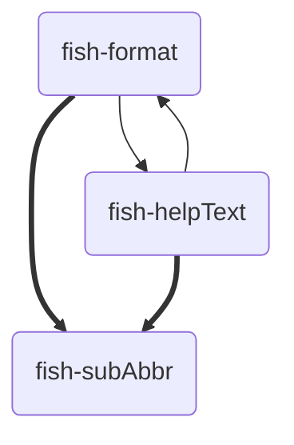

# Installation
Different installation methods officially recognised, curated for different scenarios.
## Dependencies
- [helpText](https://github.com/Drazape/fish-helpText "GitHub repository"){data-preview}: Generate formatted console help reference texts
- [format](https://github.com/Drazape/fish-format "GitHub repository"){data-preview}: Intuitively generate ANSI sequences


## Procedure
The installation involves moving Fish files from the directories

- [`functions`](https://github.com/Drazape/fish-subAbbr/tree/main/functions){data-preview} (→ `$fish_function_path`)
- [`conf.d`](https://github.com/Drazape/fish-subAbbr/tree/main/conf.d){data-preview}

to the appropriate paths in the host system, depending on the installation type.

Each file in `functions/` must be renamed such that each sub-directory's name is prefixed to it such that the filename is `parentDir_childDir_file`
!!! tip "Function Name"
    See the function's name in the respective file to obtain the file-name of it (`.fish` suffixed)

## Scope
The installation type determines the availability of the program to users
### User
Under this scope, this program is only available to the user the installation is performed for.
#### Automatic: Package Manager
Auto-updates from the package manager  
[**Fisher**](https://github.com/jorgebucaran/fisher "Fish plugin manager"){data-preview}: `#!fish fisher install Drazape/fish-subAbbr`
#### Manual
Move the directories into your user Fish configuration in your home directory (typically `~/.config/fish/`)

### System
Install fish-subAbbr system-wide, for all users.
#### Automatic
Install fish-subAbbr with no user intervention
##### Script (local)
This locally installs the program and updates each time it is run
```fish {title="curl-to-fish script" .no-select}
curl -fsSL 'https://raw.githubusercontent.com/Drazape/fish-subAbbr/main/install.fish' | run0 fish -NP
```
##### Package Manager
Use a package manager previously installed in your system to manage the installation of the package.
###### NixOS
A NixOS module with convenient configuration options is planned. For now, there is only a package.

```nix {hl_lines="4" title="flake.nix"}
{
	inputs = {
		…
		fish-subAbbr = { type="github"; owner="Drazape"; repo="fish-subAbbr"; };
		…
	};
	outputs = inputs@{ self, nixpkgs, …, ... }: {
		nixosConfigurations."yourHost" = nixpkgs.lib.nixosSystem {
			specialArgs = { inherit inputs; };
			…
		};
		…
	};
}
```
```nix {hl_lines="5" title="Module with the Fish configuration"}
{ inputs, pkgs, …, ... }: {
	…
	environment.systemPackages = [
		…
		inputs.fish-subAbbr.packages."${pkgs.stdenv.hostPlatform.system}".default
		…
	]
	…
};
```


#### Manual
The files must be moved to the vendor (`vendor_*.d`) system-wide path

Package Manager
:   Normal system path managed by the package manager

Local
:   Local directory for non-packaged programs
