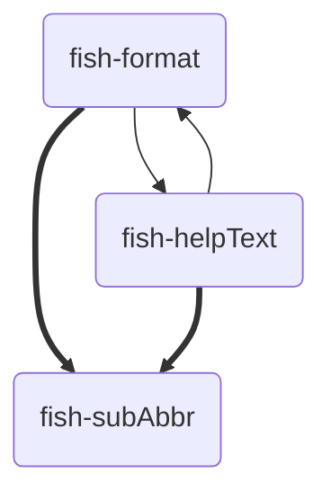

# Installation
## Dependencies
- [helpText](https://github.com/Drazape/fish-helpText "GitHub repository"){data-preview}: Generate formatted console help reference texts
- [format](https://github.com/Drazape/fish-format "GitHub repository"){data-preview}: Intuitively generate ANSI sequences


## Procedure
The installation involves moving Fish files from the directories

- [`functions`](https://github.com/Drazape/fish-subAbbr/tree/main/functions){data-preview} (→ `$fish_function_path`)
- [`conf.d`](https://github.com/Drazape/fish-subAbbr/tree/main/conf.d){data-preview}

to the appropriate paths in the host system, depending on the installation type.

Each file in `functions/` must be renamed such that each sub-directory's name is prefixed to it such that the file name is `parentDir_childDir_file`
!!! tip "Function Name"
    See the function's name in the respective file to obtain the file-name of it (`.fish` suffixed)

## Scope
### User
#### Automatic: Package Manager
Auto-updates via the package manager  
[**Fisher**](https://github.com/jorgebucaran/fisher "Fish plugin manager"){data-preview}: `#!fish fisher install Drazape/fish-subAbbr`
#### Manual
Move the directories into your Fish configuration in the home directory (`~/.config/fish/`):

### System
#### Automatic
##### Script (local)
This locally installs the program and updates each time it is run
```fish {title="curl-to-fish script" .no-select}
curl -fsSL 'https://raw.githubusercontent.com/Drazape/fish-subAbbr/main/install.fish' | run0 fish -NP
```
##### Package Manager
As of now, no distribution package manager is supported.

###### NixOS
A flake with convenient configuration options is planned.

For now, the installation can be worked around (with automatic updates). This method is not supported and may stop working after an update.

!!! warning "Manual Dependency"
    You'll need to manually install the [dependencies](#dependencies){data-preview}

```nix {hl_lines="3 4 5" title="flake.nix"}
{
	inputs = {
		…
		fish-subAbbr = { type="github"; owner="Drazape"; repo="fish-subAbbr"; };
		…
	};
	outputs = inputs@{ self, nixpkgs, …, ... }: {
		nixosConfigurations."yourHost" = nixpkgs.lib.nixosSystem {
			specialArgs = { inherit inputs; };
			…
		};
		…
	};
}
```
```nix {hl_lines="10" title="Module with the Fish configuration"}
{ inputs, … }: {
	…
	environment.systemPackages = [
		…
		inputs.fish-subAbbr.packages."${stdenv.hostPlatform.system}".default
		…
	]
	…
};
```


#### Manual
The files must be moved to the vendor (`vendor_*.d`) system-wide path

- **Package Manager**: Normal system path managed by the package manager
- **Local**: Local directory for non-packaged programs
